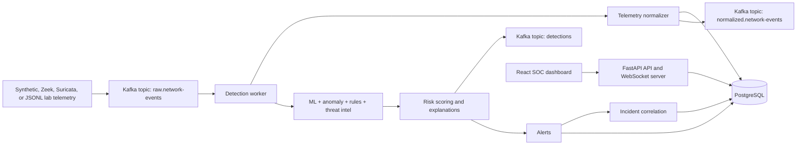

# AI-Assisted Network Detection and Response Platform

This repository is a portfolio-grade defensive security platform built from the original AI-enhanced threat detector. It keeps the legacy synthetic `/predict` and `/alerts` behavior while adding normalized telemetry ingestion, hybrid detections, explainable alert risk, incident correlation, role-protected analyst actions, and a SOC-style React dashboard.

This project is for authorized defensive lab and learning use only. It does not perform blocking, exploitation, malware execution, persistence, credential attacks, or offensive actions.

## What It Does

- Ingests synthetic Kafka JSON, Zeek conn-style JSON, and Suricata EVE JSON.
- Normalizes telemetry into an OCSF-inspired internal schema. This is not a claim of full OCSF compliance.
- Runs a hybrid detection pipeline with the existing Transformer interface, a safe heuristic model fallback, anomaly scoring, configurable JSON rules, and optional local threat-intel indicators.
- Produces explainable alerts with risk components, contributing features, MITRE ATT&CK mappings, investigation actions, raw evidence references, and related normalized events.
- Correlates alerts into deterministic incidents using source, destination, attack family, time window, indicators, and MITRE techniques.
- Provides versioned `/api/v1/*` APIs, WebSocket updates, legacy compatibility endpoints, and a dark SOC dashboard.
- Uses migration-controlled database changes and separates the FastAPI API process from the Kafka detection worker.

## Architecture



The FastAPI service serves HTTP/WebSocket APIs only. Long-running Kafka consumption is handled by `python -m backend.worker`.

## Repository Layout

```text
backend/
  main.py                       FastAPI app and compatibility endpoints
  worker.py                     Dedicated Kafka ingestion/detection worker
  telemetry.py                  Normalized event schema and parsers
  inference.py                  Governed Transformer loader and explicit fallback prediction
  model_governance.py           Dataset manifests, leakage controls, metrics, drift contracts
  model_benchmark.py            Reproducible baseline and Transformer benchmark runner
  model_registry.py             Candidate validation, promotion, archive lifecycle
  anomaly.py                    Isolation Forest loader and fallback scoring
  rules_engine.py               JSON rule validation and matching
  pipeline.py                   End-to-end detection pipeline
  correlation.py                Deterministic alert-to-incident correlation
  auth.py                       PBKDF2 password hashing, JWT, roles, audit helpers
  migrations/                   Application-owned migration runner and revisions
  rules/                        Default rules and MITRE mapping
  threat_intel/                 Local indicator list
frontend/
  src/                          React SOC dashboard
tests/                          Backend unit and API tests
docs/                           Architecture, threat model, model card, demo guide
```

## Supported Telemetry Sources

- Synthetic Kafka JSON compatible with the original producer and `/predict` flow fields.
- Zeek JSON conn logs using fields such as `ts`, `uid`, `id.orig_h`, `id.resp_h`, `proto`, `orig_bytes`, and `resp_bytes`.
- Suricata EVE JSON using `timestamp`, `src_ip`, `dest_ip`, `proto`, `flow`, and optional `tcp` fields.
- PCAP-derived flows are optional. The main app does not require packet tooling. Convert PCAPs to Zeek or Suricata JSON, or install optional tooling in a lab environment and use the `parse_pcap_flows` hook.

## Detection Architecture

The pipeline creates one normalized event and one hybrid detection per event ID. Duplicate Kafka messages reuse the existing detection and do not create duplicate alerts.

- `ml_model`: loads the existing PyTorch Transformer and scaler when present. If artifacts are missing or incompatible, a deterministic heuristic fallback keeps `/predict` and synthetic demos operational.
- `anomaly`: loads an Isolation Forest artifact when available. If absent, lightweight deterministic volume scoring is used.
- `rules`: loads `backend/rules/default_rules.json`, validates rule IDs and severities, and evaluates defensive thresholds.
- `threat_intel`: uses local indicators and cache by default. External providers are disabled unless explicitly configured and are mocked or disabled in tests.
- `risk`: stores separate components for ML confidence, anomaly score, rule severity, threat-intel confidence, asset criticality, and repeat occurrence count.

## Model Governance And Limitations

The original binary Transformer artifacts remain compatible with the runtime in explicit `legacy_compatibility` state. When artifacts are missing, invalid, ungoverned, or not marked active, model status reports `degraded_fallback`; the deterministic fallback supports the demo but is not a trained security model.

New training is manifest-driven. A manifest records the local source files, label taxonomy, feature exclusions, and group/time columns. Split code prevents sequence groups from crossing train, validation, and test partitions, fits preprocessing on train rows only, and builds sequences independently inside each partition. `random_dev_only` is labelled as unsuitable for quality claims and cannot be promoted.

No dataset, PCAP, trained artifact, benchmark output, or credential belongs in this repository. [`datasets/manifests/cic_ids2017.example.yaml`](datasets/manifests/cic_ids2017.example.yaml) is a contract example only.

### Benchmark And Promotion Flow

Run an authorized local benchmark into an ignored directory:

```powershell
.\.venv\Scripts\python.exe -m backend.model_benchmark --manifest datasets\manifests\cic_ids2017.example.yaml --output results\benchmarks --split-strategy group
```

The runner records dataset-manifest and training-config checksums, feature order, class mapping, split counts, baseline results, Transformer results, calibration signals, and a train-feature drift baseline. It does not activate a model.

Register, validate, and explicitly promote a Transformer artifact only after reviewing its held-out metrics and limitations:

```powershell
.\.venv\Scripts\python.exe -m backend.cli register-model results\benchmarks\<run>\artifacts\transformer.metadata.json
.\.venv\Scripts\python.exe -m backend.cli validate-model <model-version>
.\.venv\Scripts\python.exe -m backend.cli promote-model <model-version>
```

Promotion verifies artifact checksums again, records audit events, archives the prior active model for the same task, and marks the selected artifact active. The active artifact must then be configured through `MODEL_PATH`, `SCALER_PATH`, and `MODEL_METADATA_PATH` for a runtime process. The API never treats a candidate or invalid metadata as an active model.

The built-in development gates require held-out macro F1 of at least `0.50`, macro false-positive rate at most `0.20`, and average held-out inference latency at most `1000 ms`; a review can add minimum recall per class. These are operational guardrails, not a claim that the model is suitable for a particular environment.

## Security And Privacy

- No API keys, `.env` files, datasets, PCAPs, or model artifacts should be committed.
- External threat-intelligence lookups are disabled by default.
- There are no default production users. Create a development user explicitly with the CLI.
- JWT auth protects analyst workflow updates, incident changes, threat-intel lookup, and audit-event reads.
- Passwords are hashed with PBKDF2-HMAC-SHA256 and per-user random salts.
- CORS is configured through `CORS_ORIGINS`.

## Environment Variables

Copy `.env.example` to `.env` for local Docker development and change secrets before any shared environment.

Key variables:

- `DATABASE_URL`
- `POSTGRES_USER`
- `POSTGRES_PASSWORD`
- `POSTGRES_DB`
- `KAFKA_BOOTSTRAP_SERVERS`
- `RAW_NETWORK_EVENTS_TOPIC`
- `NORMALIZED_NETWORK_EVENTS_TOPIC`
- `DETECTIONS_TOPIC`
- `DEAD_LETTER_TOPIC`
- `KAFKA_TOPIC`
- `KAFKA_WORKER_GROUP_ID`
- `JWT_SECRET`
- `CORS_ORIGINS`
- `THREAT_INTEL_EXTERNAL_ENABLED`
- `THREAT_INTEL_CACHE_TTL_SECONDS`
- `MODEL_PATH`
- `SCALER_PATH`
- `MODEL_METADATA_PATH`

## Docker Startup

```powershell
docker compose up -d --build
```

Services:

- Kafka in KRaft mode on host port `9094`
- PostgreSQL on host port `5432`
- FastAPI on `http://localhost:8000`
- React dashboard on `http://localhost:3000`
- Detection worker as a separate process/container

Create a development analyst user:

```powershell
docker compose exec backend-api python -m backend.cli create-user --username analyst --role security_analyst
```

## Manual Development Setup

```powershell
python -m venv .venv
.\.venv\Scripts\activate
pip install -r backend\requirements.txt
npm install --prefix frontend
```

Run migrations:

```powershell
python -m backend.cli migrate
```

Run the API:

```powershell
python -m uvicorn backend.main:app --reload --host 0.0.0.0 --port 8000
```

Run the worker:

```powershell
python -m backend.worker
```

Run the frontend:

```powershell
npm start --prefix frontend
```

## Database Migrations

Migration runner:

```powershell
python -m backend.cli migrate
```

Current revision:

- `002_model_governance`

Upgrade behavior:

- Creates platform tables for users, normalized events, detections, alerts, incidents, incident-alert links, analyst feedback, threat-intel cache, model versions, audit events, dead-letter events, and schema migrations.
- Expands the legacy `alerts` table without dropping existing records.
- Extends `model_versions` with task, lifecycle state, dataset identifier, validation results, rejection reason, activation, and update fields. Existing rows become archived rather than silently active.

Downgrade behavior:

- The revision module includes a non-destructive table drop path for new platform tables.
- Legacy alert columns are intentionally not removed on SQLite-style stores.

## API Summary

Compatibility:

- `POST /predict`
- `GET /alerts`

Versioned APIs:

- `GET /api/v1/health`
- `GET /api/v1/ready`
- `POST /api/v1/auth/login`
- `GET /api/v1/events`
- `POST /api/v1/events`
- `GET /api/v1/detections`
- `GET /api/v1/alerts`
- `GET /api/v1/alerts/{alert_id}`
- `PATCH /api/v1/alerts/{alert_id}`
- `GET /api/v1/incidents`
- `GET /api/v1/incidents/{incident_id}`
- `PATCH /api/v1/incidents/{incident_id}`
- `GET /api/v1/metrics`
- `GET /api/v1/model/status`
- `GET /api/v1/models` (administrator or read-only auditor)
- `GET /api/v1/models/active` (administrator or read-only auditor)
- `GET /api/v1/models/{version}` (administrator or read-only auditor)
- `POST /api/v1/models/{version}/validate` (administrator)
- `POST /api/v1/models/{version}/promote` (administrator)
- `POST /api/v1/models/{version}/archive` (administrator)
- `POST /api/v1/threat-intel/lookup`
- `GET /api/v1/audit-events`
- `WS /api/v1/ws/alerts`

List endpoints support pagination and practical filters such as severity, status, classification, source IP, destination IP, detection source, date range, and MITRE technique where applicable.

## Demo Flow

Send one authorized lab synthetic event through Kafka:

```powershell
python -m backend.kafka_producer
```

Process Zeek or Suricata samples without Kafka:

```powershell
python -m backend.cli process-jsonl tests\fixtures\zeek_conn.jsonl --source-hint zeek
python -m backend.cli process-jsonl tests\fixtures\suricata_eve.jsonl --source-hint suricata
```

Train the lightweight anomaly detector:

```powershell
python -m backend.train_anomaly_model
```

Run a leakage-aware Transformer training pass on a local CIC-style CSV sample:

```powershell
python -m backend.train_model --data data\MachineLearningCVE.csv --sample-frac 0.1
```

Do not run full CIC-IDS2017 training as part of normal local verification.

## Tests And Checks

```powershell
pytest -q
npm test --prefix frontend -- --watchAll=false
npm run build --prefix frontend
docker compose config
```

Tests do not require live external threat-intelligence APIs.

## Runtime Release Gate

The `Runtime Release Gate` GitHub Actions workflow can be started manually from the repository's **Actions** tab by selecting **Runtime Release Gate** and choosing **Run workflow**. It also runs for pull requests and pushes to `main`.

The workflow uses a temporary GitHub-hosted Docker Compose environment to validate the PostgreSQL migration path (including legacy alert preservation), Kafka KRaft startup and recovery, API and worker health, CLI-created users, authentication and WebSocket authorization, Kafka event idempotency, Zeek and Suricata fixtures, dead-letter handling, and the local Python and React checks. External threat-intelligence providers remain disabled.

No repository or GitHub secrets are required: the PostgreSQL password, JWT secret, and temporary user passwords are generated per run, masked, and discarded during cleanup. This is a release-validation environment only, not a production deployment. On failure, use the failed workflow run's **Artifacts** section to download sanitized Compose logs and the pytest report.

Compose uses the official `apache/kafka:3.9.2` image as a single combined broker/controller KRaft node. Kafka storage is intentionally ephemeral for development and CI, so a fresh `docker compose up` starts with clean broker metadata.

## Troubleshooting

- API reports model fallback: place compatible `results/model/transformer_model.pth`, `results/scaler.gz`, and optional `results/model/metadata.json`.
- No Kafka alerts: confirm `detection-worker` is running and consuming `raw.network-events`.
- Login fails: create a user with `python -m backend.cli create-user`.
- CORS errors: set `CORS_ORIGINS` to the dashboard origin.
- Docker Kafka clients on the host should use `localhost:9094`; containers use `kafka:9092`.

## Roadmap

- Add real external threat-intel provider clients behind disabled-by-default configuration.
- Add persisted notification delivery and richer analyst timelines.
- Add production-grade auth hardening, refresh tokens, and centralized rate limiting.
- Add formal Alembic migrations if the schema grows beyond the built-in runner.
- Add drift metrics once a representative baseline is collected.
